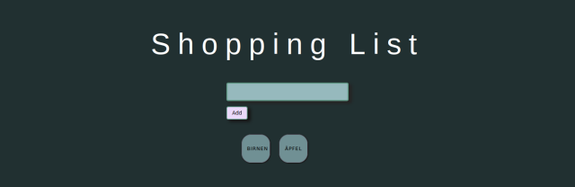

# Shopping List App


This is a List to add anything what you don't forget to buy!

## Look like this 



## Using it


You can add food or anything else to your list and it stores in your localstorage.

Than you can go Shopping. Have fun.

More is in progress...


## Requirements

* git
* node/npm

## Installation

Clone repo
```bash
git clone https://github.com/code-knackerin/ShoppingList
cd ShoppingList
```

Install NPM packages and run server
```
npm i
npm run start
```
